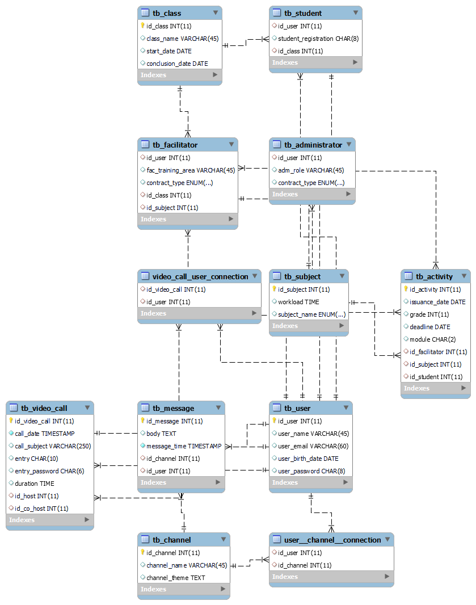

> Projeto Modolo 3 de Banco de Dados.  

# 1. Plataforma PDA

### Descrição
Sistema criado um banco de dados  pensando em uma possível plataforma onde teríamos: login de usuário, podendo esse logar como aluno, facilitador ou administrador na plataforma; um canal com todas as atividades, formulários, descritivos de projetos, entre outros materiais didáticos; um canal para comunicação entre os usuários, com canais para diferentes propósitos e mensagens; um canal de vídeo chamadas onde seriam realizadas as aulas.

Problematização:
O sistema foi criado pensando em uma instituição de ensino que atualmente usa o seguinte modelo de condução do curso:

1. DISCORD – Canal de comunicação oficial da comunidade 
2. ZOOM – Plataforma onde são dadas as aulas
3. Google Classroom – Plataforma de atividades e outros materiais didáticos.

Esse sistema foi criado pensando em uma instituição de ensino que administra atualmente duas turmas maneira simultânea, cada uma com cerca de 60 alunos, além de colaboradores multidisciplinares para cada turma, e para a gestão geral da ong e das plataformas. No dia a dia, esse modelo com várias plataformas, cada uma para uma função diferente, pode se tornar confuso e pouco prático pra quem lida com a
administração. 

Solução:
 Para solucionar esse problema, foi pensado em um banco de dados que pudesse 
armazenar de maneira conjunta todos os dados e informações necessárias para 
administração dos cursos. O banco de dados foi criado pensando em uma possível 
plataforma onde teríamos: login de usuário, podendo esse logar como aluno, facilitador ou 
administrador na plataforma; um canal com todas as atividades, formulários, descritivos de 
projetos, entre outros materiais didáticos; um canal para comunicação entre os usuários e um canal de vídeo chamadas onde seriam realizadas as aulas. 

# 2. Modelo Entidade-Relacionamento 

## Workbench modelo ER

# 3. Analises feita com base no novo modelo
 

